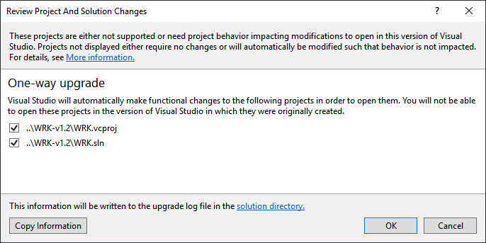
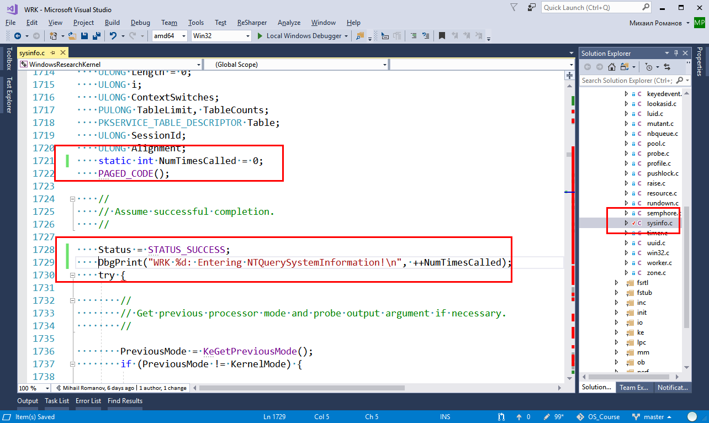
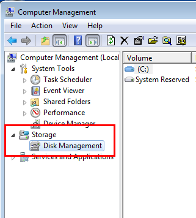
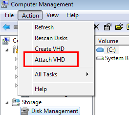
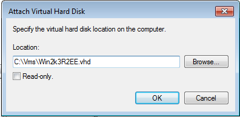
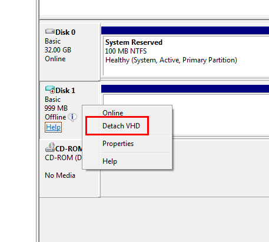
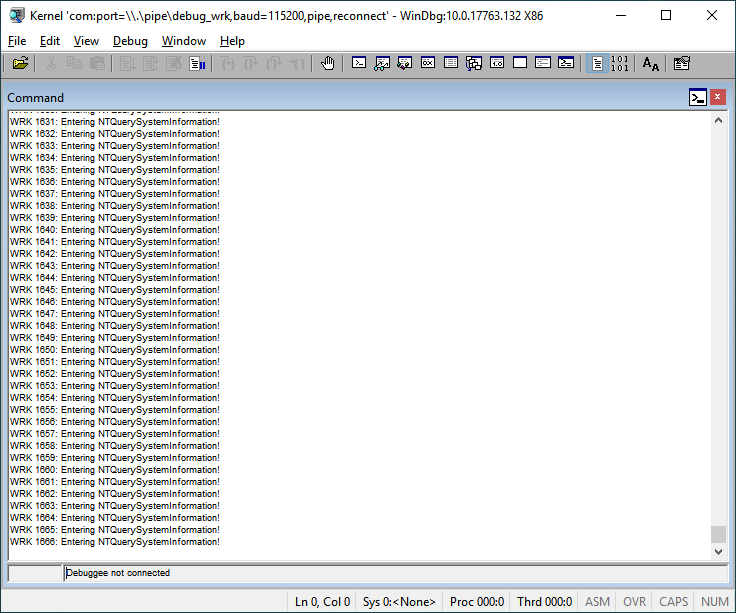

# Простая модификация ядра, использование отладочной функции

## Цель
- Ознакомиться со структорой исходного кода WRK
- Подготовиться к работе с ним в Visual Studio
- Освоить процесс модификации ядра - внесение изменений, сборку и деплой измененного ядра
- Познакомиться с функцией **DbgPrint** (печать отладочной информации из кода ядра)

## Открытие проекта в Visual Studio

1. Откройте файл солюшена (WRK.sln) в папке **Resources\WRK\WRK-v1.2** 
2. В открывшемся диалоге мастера преобразования нажмите **OK** и дождитесь окончания конвертации проекта



3. Закройте отчет по конвертации, перейдите в Solution Explorer и убедитесь, что проект корректно открылся. 


## Знакомство со структурой исходного кода ядра

Краткое описание структуры папок исходного кода можно найти в файле [README.txt](../../Resources/WRK/WRK-v1.2/README.txt)

```
The public\ directory contains a number of include files shared among system
components.  base\ntos\ contains the NTOS sources.

The primary NTOS source components included in the WRK are organized as follows:

    cache\  - cache manager
    config\ - registry implementation
    dbgk\   - user-mode debugger support
    ex\     - executive functions (kernel heap, synchronization, time)
    fsrtl\  - file system run-time support
    io\     - I/O manager
    ke\     - scheduler, CPU management, low-level synchronization
    lpc\    - local procedure call implementation
    mm\     - virtual memory manager
    ob\     - kernel object manager
    ps\     - process/thread support
    se\     - security functions
    wmi\    - Windows Management Instrumentation

    inc\    - NTOS-only include files
    rtl\    - kernel run-time support
    init\   - kernel startup
```

А в файле [Getting started with WRK.doc](../../Resources/WRK/WRK-v1.2/Getting%20started%20with%20WRK.doc) представлен простой эксперимент с ядром, который мы выполним далее

## Модификация ядра (счетчик вызовов функции и отладочная печать)

1. В открытом ранее проекте кода ядра в Visual Studio перейдите на файл **base/ntos/ex/sysinfo.c**
2. Перейдите внутрь функции **NtQuerySystemInformation** на строку 1721 (это можно сделать нажав **Ctrl+G** и набрав в появившемся окне 1721, а затем нажав **OK**)

3. Вставьте в этой строке фрагмент кода

```C++
static int NumTimesCalled = 0;
```

4. Затем опуститесь на несколько строк, ниже строки

```C++
Status = STATUS_SUCCESS;
```

и добаьте строку

```C++
DbgPrint("WRK %d: Entering NTQuerySystemInformation!\n", ++NumTimesCalled);
```

Получится примерно следующий результат:


5. Скопилируйте модифицированное ядро (не из Visual Studio, а как в предыдущем примере, через комндную строку!)

## Копирование скомпилированного ядра на виртуальный диск

1. Убедитесь что виртуальная машина с Windows 2003 не запущена
2. Запустите оснастку **Conputer management** (**Управление компьютером**)


3. Перейдите  к разделу **Disk Management**



4. И выберите в меню **Attach HDD** укажите виртуальный диск от вашей виртуалки с Windows 2003 и нажмите **OK**





5. Посмотрите, на какую букву диска был примонтирован ваш виртуальный диск:


6. Перейдите на этот диск в **Windows Explorer** (**FAR Manager** или любом ином навигаторе) и скопируйте скомпилированное ранее ядро в папку **<виртуальный_диск>:\\Windows\\System32**

7. Вернитесь в остнастку **Conputer management** и отсоедините диск (на Windows 7 его, возможно, сначала нужно будет перевести в состояние **Offline**)



8. Запустите **WinDbg** и перейдите в режим удаленной отладки ядра ([см. предущую работу](01_WRK_build_and_install.md))

9. Запустите виртуальную машину и выберите вариант запуска **WRK**
10. Дождитесь появления отладочных сообщений в окне **WinDbg**

