# Установка и настройка образа Windows 2003 Evaluation Edition

Для настройки виртуальной машины потребуется образ [Windows Server 2003 Evaluation Edition](https://www.microsoft.com/en-us/download/details.aspx?id=19727) и установленный VirtualBox (инструкция по настройке приведена для версии 6.04 eng и в других версиях могут быть отличия на каких-то из шагов).

## Создание виртуальной машины

1. Запустите **Oracle VM VirtualBox Manager** и нажмите на панели кнопку **New** 

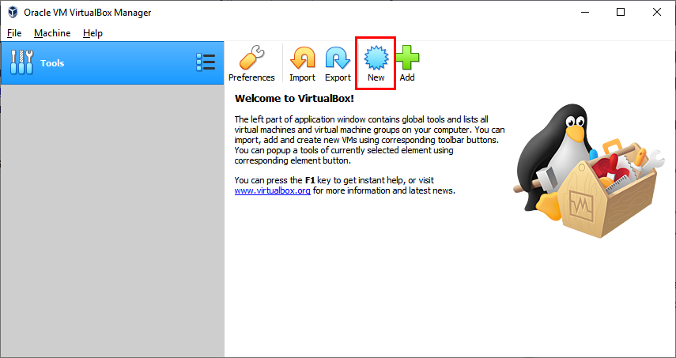

2. В диалоге **Name and operating system** заполните поля

|Поле|Значение|
|-|-|
|**Name**|Имя машины, например **WRK**|
|**Machine Folder**|Папка, где будет располагаться настройка виртуальной машины. Можно оставить по умолчанию|
|**Type**|Microsoft Windows|
|**Version**|Windows 2003 (32-bit)|

И нажмите **Next**

3. В диалоге **Memory size** укажите размер используемой памяти в **1024 MB** и нажмите **Next**

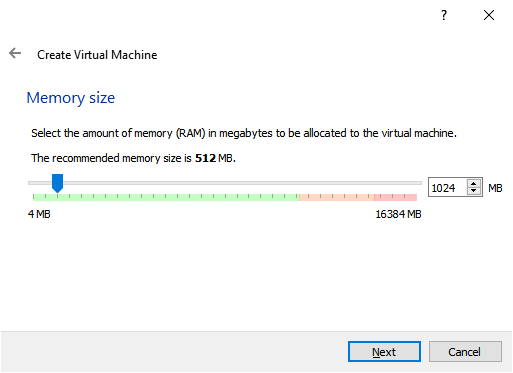

4. В диалоге **Hard disk**: 
- выберите пункт **Use an existing virtual hard disk file** и нажмите значок выбора диска
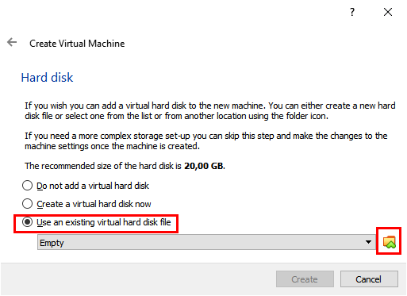

- в открывшемся диалоге нажмите кнопку **Add** 

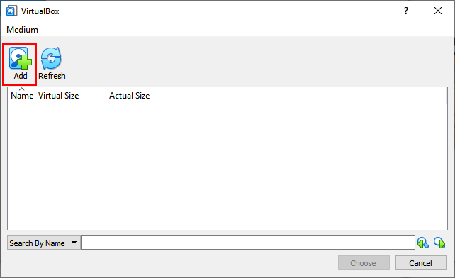

- выберите файл **Win2k3R2EE.vhd** из архива Windows 2003 Evaluation Edition

- после возвращения в диалог выбора образа убедитесь, что выбранный вами файл подсвечен и нажмите **Choose** 

- удостоверьтесь, что выбран правильный файл образа и нажмите **Create**

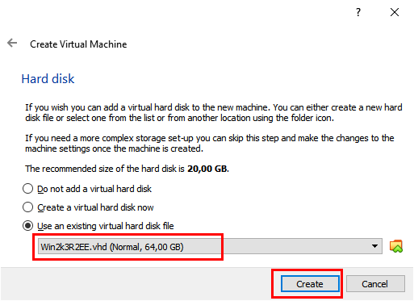

## Первый запуск и установка расширений VirtualBox на гостевую машину

1. Выделите в списке только что созданную машину и нажмите кнопку **Start**

2. Дождитесь предупреждения о том, что ОС является пробной

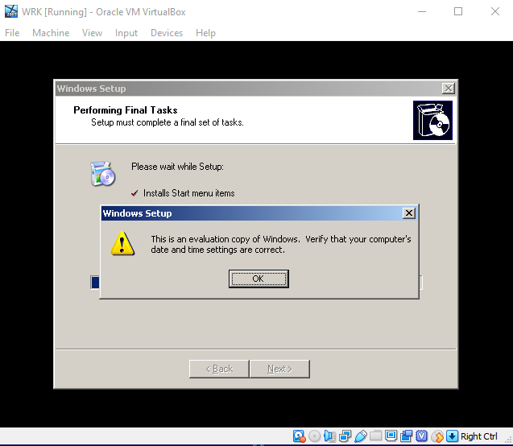

- нажмите OK
- выставите нужную Time Zone (например **GMT+04:00 Baku**)

**Внимание!!!** Обратите внимание, что если вы пытаетесь воспользоваться мышью для работы с ОС под виртуальной машиной, то происходит "захват" мыши (вы не можете вывести мышь за пределы окна виртуальной машины).
Это будет происходить до того момент пока вы не установите расширения на гостевую ОС.
Чтобы "освободить" мышь до установки расширений, просто нажмите **Right Ctrl** 

**Внимание!!!** Если в процессе настройки машина перестанет реагировать на ваши действия на несколько минут выключите машину и запустите её заново. Для этого закройте окно сессии с машиной и выберите **Power off of the machine**

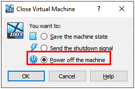

3. Дождитесь появления приглашения на вход (оно может сопровождаться сообщениями об ошибках - просто проигнорируйте и закройте окно)

4. Залогиньтесь в систему для этого:

- выберите в меню консоли виртуальной машины пункт **Input\\Keyboard\\Insert Ctrl-Alt-Del**

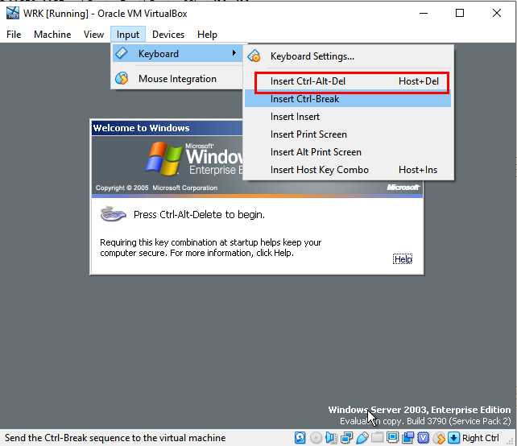

- введите логи и пароль (Administrator/Evaluation1)

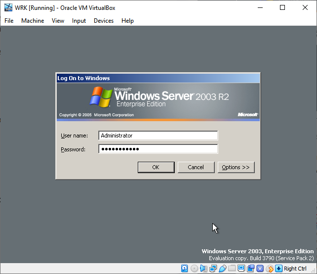

5. На открывшемся рабочем столе 

- в окне **Windows Server Post-Setup Security Update** нажмите **Finish**
- пройдите все диалоги установки нового оборудования (по возможности выбирая поиск и установку)

6. Установите расширения для гостевой ОС. Для этого:

- выберите в меню консоли виртуальной машины пункт **Devices\\Insert Guest Additions CD Image**

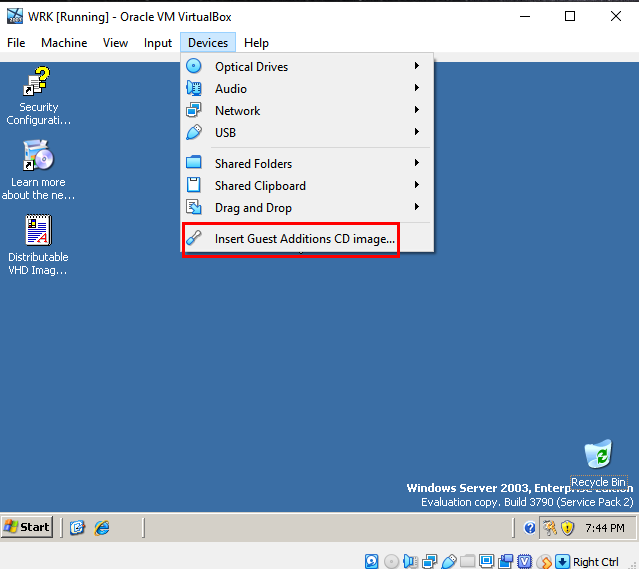

- в открывшемся на гостевой ОС установщике последовательно нажмите **Next**, **Next**, **Install**

- при появлении в процессе установки предупреждениях об установке новых устройств, нажимать **Yes** или **Continue Anyway**

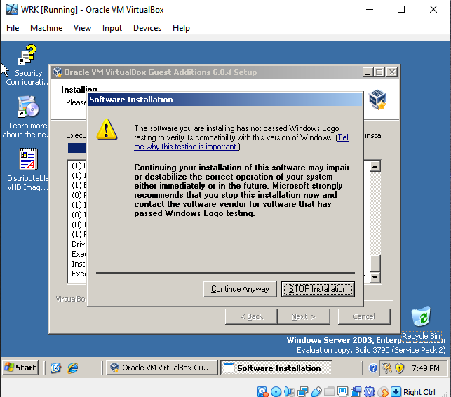

- по завершении работы выберите **Reboot now** и нажмите **Finish**

- дождитесь перезагрузки машины 

**Внимание!!!** Здесь также может потребоваться выключение виртуальной машины, которая так и не достигнет перезагрузки!

7. Проверьте, что гостевые компоненты установились успешно. Для этого

- запустите виртуальную машину
- в меню включите пункт **Input\\Mouse integration**

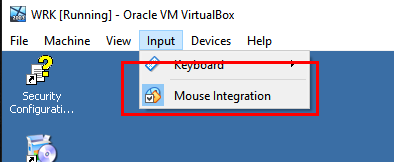

- проверьте, что при щелчке мышью она больше не "захватывается" (можно щелкнуть внутри окна виртуальной машины, а затем спокойно увести мышь за пределы окна виртуалки)

8. Включение обмена данными с гостевой машиной.

- в меню Devices настройте **Drag & Drop** и **Shared Clipboard** (можно выбрать режим Bidirectional)

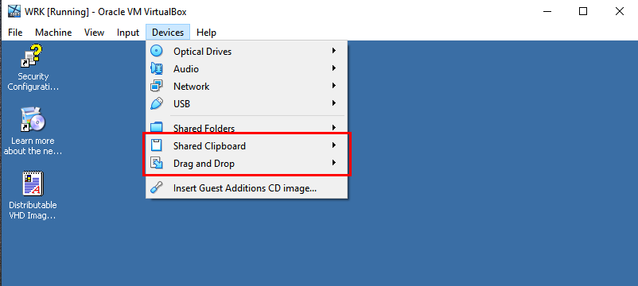
